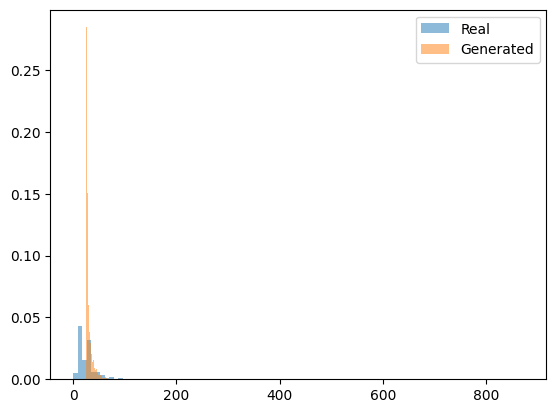
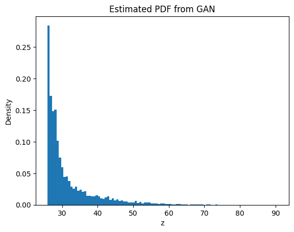

# Learning Probability Density Function using GAN

## 1. Objective

The objective of this project is to learn the probability density function (PDF) of a transformed random variable using only data samples.

No analytical form of the distribution is assumed. A Generative Adversarial Network (GAN) is used to approximate the unknown distribution.

The dataset used is the India Air Quality Dataset, and the feature selected is NO₂ concentration.

---

## 2. Dataset Preprocessing

- Extracted `no2` column
- Removed missing values
- Converted values to numeric
- Total valid samples: **419,509**

---

## 3. Transformation of Variable

The transformation applied:

\[
z = x + a_r \sin(b_r x)
\]

Where:

- Roll Number: **102303480**
- \( a_r = 3.0 \)
- \( b_r = 0.3 \)

This introduces non-linearity in the distribution.

---

## 4. GAN Architecture

### Generator
- Linear(1 → 16)
- ReLU
- Linear(16 → 1)

### Discriminator
- Linear(1 → 16)
- ReLU
- Linear(16 → 1)
- Sigmoid

Training:
- Loss: Binary Cross Entropy
- Optimizer: Adam
- Learning Rate: 0.001
- Epochs: 1500

---

## 5. Results

### 5.1 Real vs Generated Distribution

Below is the comparison between real transformed distribution and GAN-generated distribution.

### Observations

- The GAN successfully captured the main peak.
- Both distributions are right-skewed.
- Slight deviation observed in tail region.
- No severe mode collapse detected.

---

### 5.2 Estimated PDF from GAN

The estimated PDF obtained from generator samples:

### Observations

- Strong density concentration around lower values (~28–32).
- Long right tail extending toward higher values.
- Smooth density approximation.
- Overall shape successfully learned.

---

## 6. Mode Coverage Analysis

The generator captures the dominant mode effectively.  
Minor smoothing is observed compared to real distribution.

---

## 7. Training Stability

- Training showed expected oscillatory GAN behavior.
- No divergence observed.
- Model converged to a meaningful distribution.

---

## 8. Conclusion

The GAN successfully approximated the unknown probability density function using only data samples.

The generated distribution closely resembles the real transformed distribution, particularly in high-density regions.

---

## 9. Summary Table

| Parameter | Value |
|------------|--------|
| Roll Number | 102303480 |
| Total Samples | 419,509 |
| a_r | 3.0 |
| b_r | 0.3 |
| Epochs | 1500 |
| Learning Rate | 0.001 |
| Hidden Units | 16 |

---
